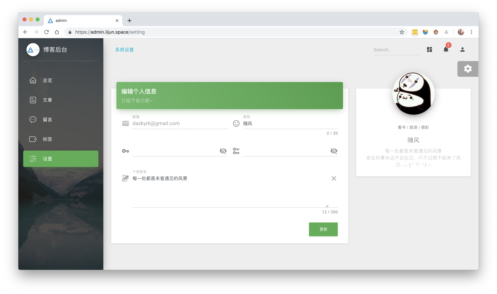

# blog
## 个人网站

服务端 使用NestJs、MongoDB、Typescript

admin后台 使用[Vuetify主题](https://demos.creative-tim.com/vuetify-material-dashboard/#/dashboard)、NuxtJs

前台 使用NuxtJs

**site: [lijun.space](https://lijun.space)**

后台截图：
### 文章管理页：

### 文章编辑页：

### 设置页：

>>>>>>> develop
